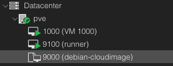
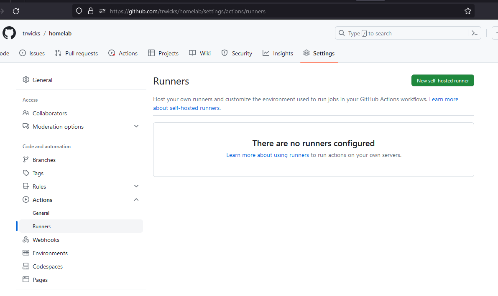

## Introduction

This is a guide to document the creation of a Self-hosted Github runner in a homelab environment. The reason to set up a runner in your homelab is that the runner will enable Github workflows to run scripts and other automation software from the runner. This method demonstrates how to use Proxmox to create a VM and install and configure a Gitlab runner and is for testing purposes only. It is a basic project but I believe it makes you more familiar with Proxmox, setting up VMs and installing and configuring software using the command line.

Being comfortable with the command line using either a Linux shell and powershell is a great skill for performing a variety of tasks in different computing environments. A command line is also great as commands can be easily recorded to show how you achieved a task, and these commands can be thrown into a wiki for quick reference material in similar scenarios. Often I fondly remember well explained commands left by admins and developers in a wiki that have worked perfectly a few years after they were initially written.

The rough steps for this demonstration is as follows:
- Describe dependencies
- Create VM template and VM to use on Proxmox
   - Setup new user in Proxmox
   - Generate and save SSH key for that user to use
   - Create the runner VM
- Install and configure a Github Runner
- Run a test workflow

## Dependencies

What components do we need to complete this project?

**Proxmox** -
For starters, I am assuming that you have Proxmox installed (version 8) on a machine somewhere in your homelab. If you don't and would like to set Proxmox up there are a lot of good guides on this subject that will do a better job at running through the initial setup of the Proxmox[1]. I would like to start from a point where Proxmox is alive and kicking, available on a local area network at `https://<your proxmox IP>:8006`. I am using an old computer to run Proxmox, which has a CPU with 4 cores and 32 GB of RAM and a 1 TB SSD.

**Github** -
Having a Github account and test repository is also required for running the Github Workflow and setting up the Github Runner. Github's documentation is a great starting point for understanding Github Workflows and self-hosted runners[3].

**Unix Shell** - The only software I need on my local machine to complete this task is an SSH client to access Proxmox. I am going to use the SSH client that comes with Ubuntu on Windows Subsystem for Linux, for this task. Git, or a Git client, is also required for pushing code changes to your Github repository. 

## Proxmox - Preliminary Configuration

For this part I will SSH into the Proxmox host in order to create a VM template that can be used to create Virtual Machines on the Proxmox hypervisor. I find creating the template using the command line is quicker and repeatable than trying to use the Proxmox web interface.

First, I will need a non-root user for creating templates and virtual machines on Proxmox. You can use the root user but I think it is good to have some basic familiarity with how to create Linux users that integrate with the Proxmox service. This knowledge is also useful if you need to create a separate user account for running other automation using Terraform or Ansible. For this project I will create a Linux group called "homelabbers" and a Linux user called "homelab". The Linux group will have Admin privileges on Proxmox and the Linux user will belong to this group, inheriting those permissions.

The commands to perform this are given below. To perform these commands you will need to SSH onto the Proxmox server using the root user's credentials.

```bash
# Set the names of the user and group variables.
GROUP=homelabbers
USER=homelab

# Create and configure the Linux/PVE group.
groupadd $GROUP
pveum groupadd $GROUP -comment "Homelab Admins"
pveum acl modify / --roles Administrator --group $GROUP

# Create and configure the homelab user, create a password, and associate the user with the homelabbers, sudo and kvm group.
useradd -g $GROUP -m $USER
usermod -a -G sudo homelab
usermod -a -G kvm homelab

passwd $USER # prompts for a password.
pveum user add $USER@pam
pveum user list
pveum usermod $USER@pam -group $GROUP
```

As an optional quality of life improvement, modify the sudoers file to grant passwordless access to superuser commands.

```bash
visudo
# change line %sudo ALL=(ALL:ALL) ALL to %sudo ALL=(ALL:ALL) NOPASSWD: ALL
```

The next command creates an SSH key pair and copies the public SSH key to the Proxmox host so you can connect to the machine using the homelab user. The public key is copied to the homelab's home directory using `scp`. For test environments I like to use separate key pairs so my important SSH keys are not mixed up in test environments. 

```bash
PROXMOX_HOST=192.168.1.10
KEY_NAME=homelab
ssh-keygen -t ecdsa -f $KEY_NAME
ssh-copy-id -i $KEY_NAME homelab@$PROXMOX_HOST
scp -i $KEY_NAME $KEY_NAME.pub homelab@$PROXMOX_HOST:~/
```

## Proxmox - VM Template Creation

A VM template is required to make VM clones that are used as the foundation for new Virtual Machines that will run in the homelab Proxmox environment. The following script block installs some dependencies on the Proxmox host and then downloads and sets up a VM template.

There is a bit going on in the code block so I have broken it down into two chunks. First, we need to update the package lists on Proxmox to remove the Proxmox enterprise repositories (subscription required) and add debian repositories so we can install some packages.

```bash
# Note: connect to Proxmox host ssh -i homelab homelab@$PROXMOX_HOST

sudo rm /etc/apt/apt.conf.d/10pveapthook
sudo rm /etc/apt/sources.list.d/pve-enterprise.list

echo "deb http://download.proxmox.com/debian/pve bookworm pve-no-subscription" | sudo tee /etc/apt/sources.list.d/proxmox.list

sudo apt update
sudo apt install -y libguestfs-tools
```

Next, I download the Debian Cloud Image to the Proxmox host and use QEMU/KVM  CLI tool (`qm`) to create a VM using ID of 9000, set up disks used by the VM and finally creating a template from the VM [2]. The `virt-customize` tool is used to install the guest agent software so Proxmox can receive information from the VM. 

```bash
IMG_URL=https://cloud.debian.org/images/cloud/bullseye/20230802-1460/debian-11-generic-amd64-20230802-1460.qcow2
# From https://cloud.debian.org/images/cloud/bullseye/20230802-1460/
# Needs to be updated occasionally.

wget -O /tmp/debian-server.img $IMG_URL
virt-customize -a /tmp/debian-server.img --install qemu-guest-agent
sudo qm create 9000 --memory 2048 --name debian-cloudimage \
   --agent enabled=1 \
   --net0 virtio,bridge=vmbr0

sudo qm importdisk 9000 /tmp/debian-server.img local-lvm
sudo qm set 9000 --scsihw virtio-scsi-pci --scsi0 local-lvm:vm-9000-disk-0

sudo qm set 9000 --ide2 local-lvm:cloudinit
sudo qm set 9000 --boot c --bootdisk scsi0
sudo qm set 9000 --serial0 socket --vga serial0
sudo qm template 9000
```

The created VM template should be listed on the Proxmox web interface.



## Proxmox - Virtual Machine Creation

After the VM Template is available on the Proxmox host a single VM is created with a static IP address and the SSH key of the homelab user for accessing the VM once it is created. The `qm set` commands configure the VM to use a specific IP address (please change this to suit your network requirements), network gateway, CPU and RAM, and public ssh key. Finally the root volume of the VM is resized to 50GB and the VM is started.

```bash

VM_ID=9100

sudo qm clone 9000 $VM_ID \
   --name runner \
   --full
sudo qm set $VM_ID --cores 2 --memory 4096
sudo qm set $VM_ID --ipconfig0 ip=192.168.1.15/24,gw=192.168.1.1

sudo qm set $VM_ID --sshkey ~/homelab.pub
sudo qm set $VM_ID --nameserver 1.1.1.1
sudo qm set $VM_ID --ciuser admin
sudo qm resize $VM_ID scsi0 +50G
sudo qm start $VM_ID
```


## Runner Virtual Machine - Self-hosted Runner Configuration

For this example I will use the installation instructions provided by Github. These instructions are found by navigating to the Settings > Actions > Runner page in your repository and selecting "New self-hosted runner".



On the following page grab the download and configuration commands and run those commands on the Proxmox VM runner.

```bash
mkdir actions-runner && cd actions-runner
curl -o actions-runner-linux-x64-2.308.0.tar.gz -L https://github.com/actions/runner/releases/download/v2.308.0/actions-runner-linux-x64-2.308.0.tar.gz
tar xzf ./actions-runner-linux-x64-2.308.0.tar.gz

# Note: I have labelled the runner "homelab" by passing the `--labels homelab` flag during the configuration command.
./config.sh --unattended --labels homelab --url https://github.com/trwicks/homelab \
   --name homelab-runner --token <token>

sudo ./svc.sh install
sudo ./svc.sh start
sudo ./svc.sh status
```

If this has worked correctly the runner should be in an idle state.


## Github - Create a Workflow

Lastly, I want to create a Github Action to use the runner to run some simple commands.

Create the workflow template in your .github/workflows directory. The workflow template below runs every 5 minutes on the self-hosted runner labelled "homelab". Every time the workflow is executed the self-hosted runner will run the commands `ip addr; whoami` and this will be displayed in the output section of the workflow on Github.

```yaml
name: project-1
on:
 schedule:
   - cron: '*/5 * * * *' # every 5 mins
jobs:
 just-some-commands:
   runs-on:
     labels: homelab
   steps:
     - uses: actions/checkout@v3
     - run: ip addr; whoami
```

Commit and push the new workflow file up to your repository.

```bash
git add .github/workflows/<workflow filename>
git commit -m "Adding test workflow."
git push origin <your branch>
```

From the Github Action console the Workflow should have been successfully run and outputs from the commands are displayed.


## Proxmox - Remove Resources

To remove the VM and VM template run the following commands from the homelab or root user on Proxmox.

```
# Stop and destroy the Gitlab Runner VM
qm stop 9001
qm destroy 9001

# Remove the created template
qm destroy 9000

# Remove the homelab user
pveum user delete homelab@pam
userdel homelab
pveum user list

# Remove the homelab group
pveum group delete homelabbers
groupdel homelabbers
pveum group list

# Remove the workflow
rm .github/workflows/<workflow filename>
git add .github/workflows/<workflow filename>
git commit -m "Removing test workflow."
git push origin <your branch>
```

## References

- [1] - [Getting Started with Proxmox (Youtube)](https://www.youtube.com/watch?v=sZcOlW-DwrU)
- [2] - [QEMU/KVM CLI docs](https://pve.proxmox.com/pve-docs/qm.1.html)
- [3] - [Github Documentation - Self-hosted Runners](https://docs.github.com/en/actions/hosting-your-own-runners/managing-self-hosted-runners/about-self-hosted-runners)
- [4] - [Managing SSH Keys - Redhat](https://www.redhat.com/sysadmin/manage-multiple-ssh-key-pairs)


